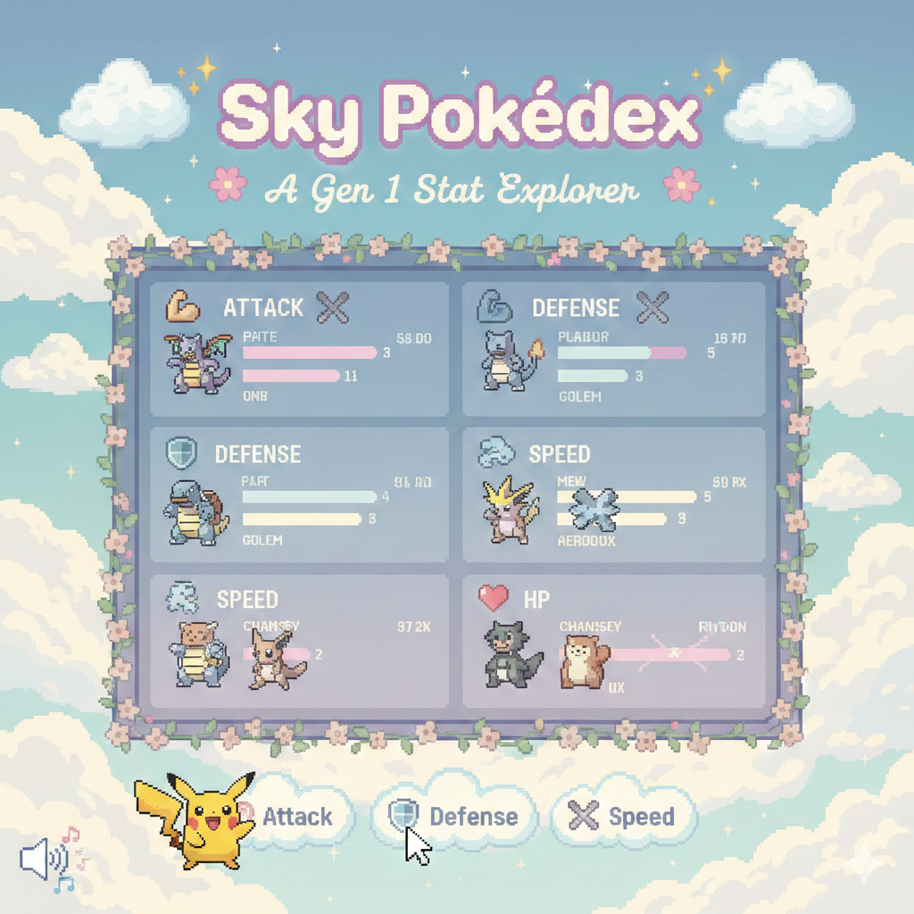
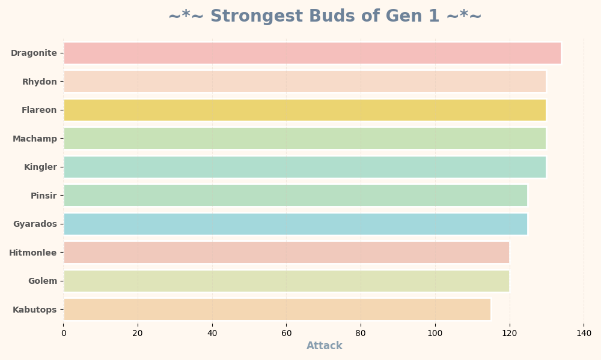
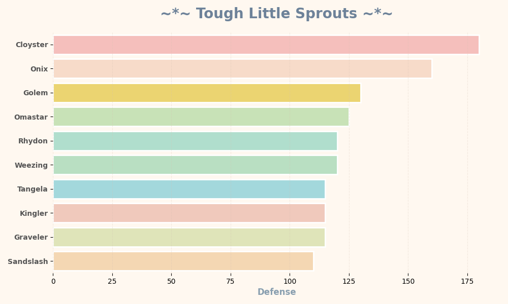
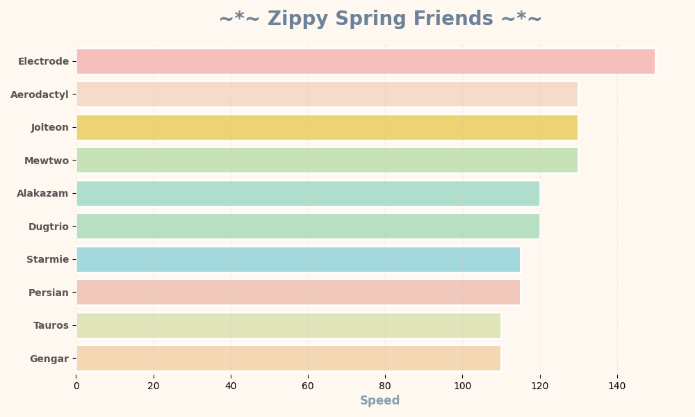

# ☁️✨ Pokédex-Analysis ✨☁️

<p align="center">
  
</p>

<p align="center">
  <b>🌸 A Gen 1 Stat Explorer 🌸</b><br>
  <i>Analytics... but make it pixel aesthetic.</i>
</p>

<p align="center">
  
  
  
  
</p>

---

## 🌼 Project Overview

**Pokédex-Analysis** explores the first **151 Generation 1 Pokémon**, blending data engineering with retro gaming vibes. It acts as a pixel-styled interactive analytics dashboard that highlights top performers across:

* **⚔️ Attack**
* **🛡️ Defense**
* **💨 Speed**
* **❤️ HP**

Built entirely with **Python**, **SQLite**, and **Streamlit**, this project proves that data doesn't have to be boring—it should sparkle a little. ✨

---

## 🚀 Getting Started

### 1. ⚡ Data Collection (`main.py`)
The application fetches real Pokémon data directly from the **PokéAPI** and stores it locally in a structured SQLite database. 

**Data Collected:**
* Name & Type
* Base Stats (HP, Attack, Defense, Speed)
* Sprite URL 🖼
* Cry URL 🔊

Run the collector to build the magical `pokedex.db` file:
```bash
python main.py
```

---

## 2. 💪 Data Analysis (analyse.py)

The script loads the database to perform quick queries, such as identifying the strongest Pokémon based on Attack stats.

🌟 Real Output:
```bash
💪 THE STRONGEST POKEMON IS:
----------------------------
Name:    Dragonite
Attack:  134
Type:    Dragon
HP:      91
Defense: 95
Speed:   80
```
Dragonite really said main character energy.

---

## 3. 🌷 Static Visualisations (visualise.py)

Before launching the app, the system generates Spring-themed stat charts using Matplotlib & Seaborn. Soft palette. Clean layout. No clutter. Just vibes. 🌸

🌸 Strongest Buds (Attack)	🌿 Tough Sprouts (Defense)	🌬 Zippy Friends (Speed)
	
	


Run the visualisation script:

```Bash
python visualise.py
```
---

## 4. 🎮 Interactive Dashboard (app.py)
This is where things get ✨ alive ✨. The dashboard is built with Streamlit, injected with custom HTML/CSS/JS to break out of the standard data frame look.

✨ Features

☁️ Animated moving cloud background

👾 Pixel-style font integration

🔘 Custom navigation buttons

📊 Smooth animated stat bars (Click to reveal!)

---

## 5. 🔊 Pokémon cries on interaction

▶️ Run Locally

```Bash
streamlit run app.py
```
---

## 6. 🎥 Dashboard Preview

One clean recording. Smooth transitions. All stat tabs shown.

<p align="center">  </p>

---

## 7. 🧠 Tech Stack
```bash
Component	Technology
Language	Python 🐍
Database	SQLite 🗄
Data Processing	Pandas 🐼
Visualisation	Matplotlib & Seaborn 🎨
Frontend/App	Streamlit 🌐
Styling	HTML / CSS / JavaScript 💻
Data Source	PokéAPI 🔗
```
---

## 8. 🗂 Project Structure
```bash
Sky-Pokedex/
├── notebooks/
│    ├── app.py                  # Main Streamlit Dashboard application
│    ├── main.py                 # Data collection script (API -> SQLite)
│    ├── visualise.py            # Static chart generation
│    └── analyse.py              # Terminal-based data analysis
│
├── data/
│   └── pokedex.db          # Generated SQLite database
│
└── images/                 # Assets for README and App
    ├── title.png
    ├── strongest_pokemons.png
    ├── defense_pokemons.png
    ├── Fastest_pokemons.png
    ├── dashboard_demo.gif
    └── background.png
```

---

## 9. 🌟 What This Project Demonstrates

This isn't just plotting. This is full pipeline energy: 
```bash
Data → Storage → Analysis → Visualisation → Interaction.
```

✔ REST API Integration: Handling requests and JSON data.

✔ SQL Database Design: Creating schemas and executing queries.

✔ Data Wrangling: Cleaning and sorting data with Pandas.

✔ Frontend Styling: Injecting custom CSS into Streamlit.

✔ Full Stack Logic: Combining backend data with frontend interactivity.

---

## 11. 🚀 Future Enhancements
[ ] 🔍 Add Pokémon search bar

[ ] 🎭 Filter by specific Types

[ ] 📈 Add Radar Chart comparisons

[ ] ☁️ Deploy to Streamlit Cloud

[ ] 🧬 Add Gen 2 & Gen 3 support

---

<p align="center"> <i>Made with 💖 and Python.</i> </p>